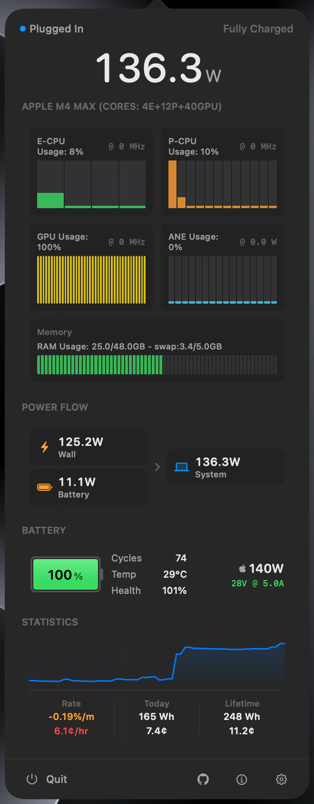

# watt

menu bar app that displays real-time power consumption in watts. monitor power draw, CPU usage, battery health, and energy costs.

<p align="left">
  
</p>

`watt` reads power data from multiple macOS system sources:

- **SMC**: Real-time power readings via SMC keys (`PSTR`, `PDTR`, `SBAP`)
- **IOKit**: Battery properties from `AppleSmartBattery` including voltage, amperage, capacity, and health
- **IOPowerSources**: Charger details and power adapter information

## Installation

### [Homebrew](https://brew.sh)

```bash
brew install --cask --no-quarantine zimengxiong/watt/watt
```

### Building from Source

Requires [Xcodegen](https://github.com/yonaskolb/XcodeGen) and Xcode Command Line Tools.

```bash
git clone https://github.com/zimengxiong/watt.git
cd watt

# Build and run
make open

# Or install to /Applications
make install
```

See `make help` for all available targets.

# Extra

<p align="left">
  
</p>

## Acknowledgments

CPU, GPU, and ANE usage monitoring is based on [asitop](https://github.com/tlkh/asitop) by Timothy Liu. The approach uses Apple's `powermetrics` tool to read accurate idle ratios and energy consumption data from Apple Silicon.
