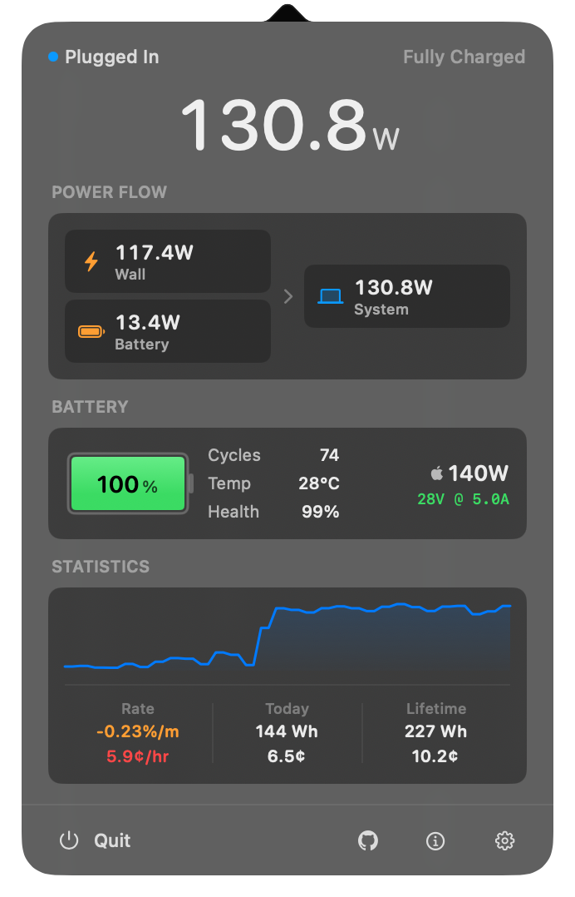
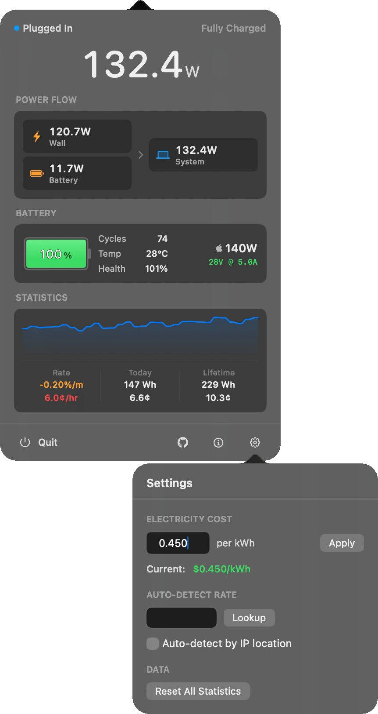

<p align="left">
  
</p>

# watt

menu bar app that displays real-time power consumption in watts. monitor power draw, battery health, and energy costs.

<p align="left">
  
</p>

watt reads power data from multiple macOS system sources:

- **SMC (System Management Controller)**: Real-time power readings via SMC keys (`PSTR`, `PDTR`, `SBAP`)
- **IOKit**: Battery properties from `AppleSmartBattery` including voltage, amperage, capacity, and health
- **IOPowerSources**: Charger details and power adapter information

## Installation

### Homebrew

```bash
brew tap zimengxiong/watt
brew install watt
```

### Building from Source

Requires [Xcodegen](https://github.com/yonaskolb/XcodeGen) and Xcode Command Line Tools.

```bash
git clone https://github.com/zimengxiong/watt.git
cd watt

# Build and run
make open

# Or install to /Applications
make install
```

See `make help` for all available targets.

### Pre-built Binary

Download the latest release from the [Releases](https://github.com/zimengxiong/watt/releases) page.

# Extra


